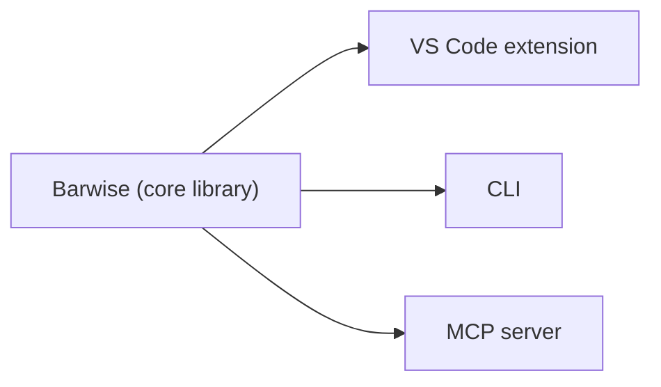

# Semantic Praxis

Semantic Praxis builds tools and writing to keep an organisation's shared
meaning precise. This repository houses Barwise, an Object-Role Modeling
(ORM 2) toolkit — a fact-based conceptual modeling method — and associated
surfaces: a core library, a VS Code extension, a CLI, and an MCP server.
Read on for status, background, and contribution guidance.

## Projects
- **barwise:** ORM 2 tool — core library, VS Code extension, CLI, MCP server. https://github.com/semantic-praxis/barwise (primary project)

## What's here / Status
- Core library: conceptual modeling primitives and validation — (alpha)
- VS Code extension: editor integration for ORM documents — (alpha)
- CLI: command-line utilities for transforming and validating models — (alpha)
- MCP server: integration surface for automated workflows — (alpha)

## Why should I care

Barwise is a hub you can rely on, not a gate you have to clear. When you
consult it, it keeps implementation honest to the agreed understanding of the
business; when you don't, delivery rolls on unblocked. It holds a conceptual
model of your business and connects to the artifacts you already maintain. A
few people who get something out of that:
- **You maintain a database or dbt project.** Import your DDL or models and see where the schema has drifted from the meaning it was supposed to capture.
- **You design APIs.** Compare an OpenAPI spec against the shared model, so an entity means the same thing across services.
- **You own what the business *means*.** Keep a precise account of your terms and facts — one that stays honest because it's tied to the systems actually running, not a glossary off to the side.

## Background

Every organization runs on shared meaning: agreements about what its terms refer
to, which facts it keeps, and how its concepts connect. That meaning is seldom
written down with any precision, and when it is, the writing tends to go stale.
Semantic Praxis builds tools and writing for the work of keeping it precise —
what domain-driven design calls a *ubiquitous language*.

We take the name seriously. **Praxis** is reflective action: practice and
theory revising each other as the work goes on. It stands apart from *poiesis*
— making, the turning out of a product that is finished once made — and from
*theoria* — contemplation, holding the world at a distance. Semantic modeling
_belongs_ with praxis. The model of a business is never done. The business
changes, the people in it change, understanding deepens, and the model has to
keep up or quietly turn into fiction.

This is, in James Carse's terms, an infinite game: one played to keep playing
rather than to bring to an end - winning in business means you get to keep
playing, after all. A good model is not a deliverable handed off and forgotten.
It is an instrument kept in tune. The tools here are made for that ongoing work,
not for the illusion of a final answer.

## Contributing
- Open issues and pull requests on the linked project repo (see Projects).
- Target branch: `main`. Include a short description, motivation, and tests where applicable.
- For design or method questions, open a discussion on the project repo so we can capture the conversation.
